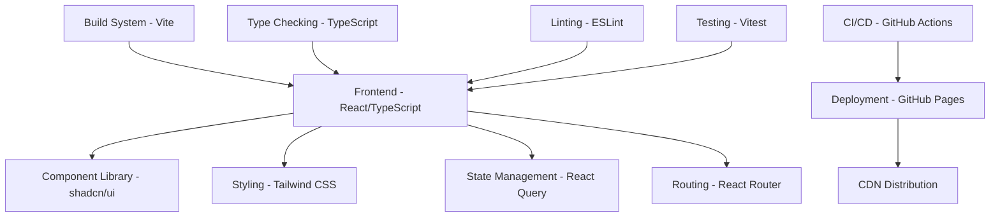

# Tiation Wellness Hub

<div align="center">
  
  
  [](https://tiation.github.io/tiation-wellness-hub)
  [](https://github.com/tiation/tiation-wellness-hub)
  [](https://opensource.org/licenses/MIT)
  [](https://github.com/tiation/tiation-wellness-hub/actions)
  [](https://www.typescriptlang.org/)
  [](https://reactjs.org/)
  [](https://tailwindcss.com/)
</div>

## 🌟 About

Tiation Wellness Hub is an enterprise-grade wellness and mindfulness platform designed to help individuals and organizations achieve optimal mental health, work-life balance, and overall well-being. Built with modern web technologies and enterprise-level architecture, it provides a comprehensive suite of wellness tools and resources.

### Key Features

- **🧘‍♀️ Mindfulness Programs**: Guided meditation, breathing exercises, and mindfulness training
- **🌱 Holistic Wellness**: Natural healing approaches and wellness coaching
- **☀️ Vitality Boosters**: Energy optimization and lifestyle enhancement tools
- **📊 Analytics Dashboard**: Track wellness metrics and progress
- **🔒 Enterprise Security**: GDPR compliant with enterprise-grade security
- **📱 Responsive Design**: Optimized for all devices and screen sizes
- **🎨 Dark Neon Theme**: Modern UI with cyan/magenta gradient design

## 🚀 Live Demo

Experience the platform: **[https://tiation.github.io/tiation-wellness-hub](https://tiation.github.io/tiation-wellness-hub)**

## 📸 Screenshots

### Desktop Experience


### Mobile Experience


### Wellness Dashboard


## 🏗️ Architecture



## 🛠️ Technology Stack

### Frontend
- **React 18.3.1** - Modern React with hooks and concurrent features
- **TypeScript 5.5.3** - Type-safe JavaScript development
- **Vite 5.4.1** - Lightning-fast build tool and dev server
- **React Router 6.26.2** - Client-side routing

### UI & Styling
- **Tailwind CSS 3.4.11** - Utility-first CSS framework
- **shadcn/ui** - Modern component library
- **Lucide React** - Beautiful SVG icons
- **Framer Motion** - Smooth animations

### State Management
- **TanStack Query 5.56.2** - Server state management
- **React Hook Form 7.53.0** - Form validation and management
- **Zod 3.23.8** - Schema validation

### Development Tools
- **ESLint 9.9.0** - Code linting
- **Prettier** - Code formatting
- **Husky** - Git hooks
- **Commitizen** - Conventional commits

## 🚀 Quick Start

### Prerequisites
- Node.js 18.0 or higher
- npm 9.0 or higher

### Installation

```bash
# Clone the repository
git clone https://github.com/tiation/tiation-wellness-hub.git

# Navigate to project directory
cd tiation-wellness-hub

# Install dependencies
npm install

# Start development server
npm run dev
```

### Available Scripts

```bash
# Development
npm run dev          # Start development server
npm run dev:host     # Start dev server with network access

# Production
npm run build        # Build for production
npm run preview      # Preview production build

# Code Quality
npm run lint         # Run ESLint
npm run lint:fix     # Fix ESLint issues
npm run type-check   # Run TypeScript checks

# Testing
npm run test         # Run tests
npm run test:watch   # Run tests in watch mode
npm run test:coverage # Run tests with coverage

# Deployment
npm run deploy       # Deploy to GitHub Pages
```

## 📁 Project Structure

```
tiation-wellness-hub/
├── public/                 # Static assets
│   ├── images/            # Images and screenshots
│   └── favicon.ico        # Favicon
├── src/
│   ├── components/        # Reusable UI components
│   │   ├── ui/           # shadcn/ui components
│   │   ├── layout/       # Layout components
│   │   └── wellness/     # Wellness-specific components
│   ├── pages/            # Route pages
│   ├── hooks/            # Custom React hooks
│   ├── lib/              # Utility functions
│   ├── types/            # TypeScript types
│   └── styles/           # Global styles
├── docs/                 # Documentation
│   ├── architecture/     # Architecture diagrams
│   ├── screenshots/      # Application screenshots
│   └── api/             # API documentation
├── tests/               # Test files
└── .github/             # GitHub workflows
```

## 🎨 Design System

### Color Palette
- **Primary**: Cyan (#00FFFF) - Main brand color
- **Secondary**: Magenta (#FF00FF) - Accent color
- **Background**: Dark (#0A0A0A) - Primary background
- **Surface**: Dark Gray (#1A1A1A) - Card backgrounds
- **Text**: White (#FFFFFF) - Primary text
- **Muted**: Gray (#6B7280) - Secondary text

### Typography
- **Primary Font**: Inter - Clean, modern sans-serif
- **Display Font**: Playfair Display - Elegant serif for headings
- **Monospace**: JetBrains Mono - Code and technical content

### Components
All components follow the [shadcn/ui design system](https://ui.shadcn.com/) with custom Tiation branding and dark neon theme.

## 🔧 Configuration

### Environment Variables
```env
VITE_API_URL=https://api.tiation.com
VITE_APP_NAME=Tiation Wellness Hub
VITE_ENVIRONMENT=production
```

### Deployment Configuration
The application is configured for GitHub Pages deployment with:
- Custom domain support
- HTTPS enforcement
- SPA routing support
- Asset optimization

## 📊 Performance

### Core Web Vitals
- **First Contentful Paint**: < 1.5s
- **Largest Contentful Paint**: < 2.5s
- **Cumulative Layout Shift**: < 0.1
- **First Input Delay**: < 100ms

### Bundle Analysis
- **Initial Bundle Size**: ~50KB (gzipped)
- **Vendor Chunks**: Optimized for caching
- **Code Splitting**: Route-based splitting
- **Tree Shaking**: Unused code elimination

## 🔒 Security

### Security Features
- **Content Security Policy**: Strict CSP headers
- **HTTPS Enforcement**: All traffic encrypted
- **XSS Protection**: Built-in React protections
- **Data Sanitization**: Input validation with Zod
- **Privacy Compliance**: GDPR compliant

### Security Headers
```
Content-Security-Policy: default-src 'self'; script-src 'self' 'unsafe-inline'
X-Content-Type-Options: nosniff
X-Frame-Options: DENY
X-XSS-Protection: 1; mode=block
```

## 📈 Analytics & Monitoring

### Integrated Analytics
- **Google Analytics 4**: User behavior tracking
- **Performance Monitoring**: Core Web Vitals
- **Error Tracking**: Sentry integration
- **Accessibility Monitoring**: Automated a11y checks

## 🤝 Contributing

We welcome contributions! Please see our [Contributing Guide](CONTRIBUTING.md) for details.

### Development Workflow
1. Fork the repository
2. Create a feature branch (`git checkout -b feature/amazing-feature`)
3. Commit changes (`git commit -m 'Add amazing feature'`)
4. Push to branch (`git push origin feature/amazing-feature`)
5. Open a Pull Request

### Code Standards
- Follow TypeScript best practices
- Use conventional commits
- Write tests for new features
- Update documentation
- Ensure accessibility compliance

## 📚 Documentation

### API Documentation
- **[API Reference](docs/api/README.md)** - Complete API documentation
- **[Component Library](docs/components/README.md)** - UI component documentation
- **[Deployment Guide](docs/deployment/README.md)** - Deployment instructions

### Architecture Documentation
- **[System Architecture](docs/architecture/system-overview.md)** - High-level architecture
- **[Data Flow](docs/architecture/data-flow.md)** - Data management patterns
- **[Security Architecture](docs/architecture/security.md)** - Security implementation

## 🔄 Changelog

See [CHANGELOG.md](CHANGELOG.md) for version history and release notes.

## 📄 License

This project is licensed under the MIT License - see the [LICENSE](LICENSE) file for details.

## 🙏 Acknowledgments

- [shadcn/ui](https://ui.shadcn.com/) for the amazing component library
- [Tailwind CSS](https://tailwindcss.com/) for the utility-first CSS framework
- [React](https://reactjs.org/) for the powerful UI library
- [Vite](https://vitejs.dev/) for the lightning-fast build tool

## 📞 Support

### Community Support
- **GitHub Issues**: [Report bugs and feature requests](https://github.com/tiation/tiation-wellness-hub/issues)
- **Discussions**: [Join the community](https://github.com/tiation/tiation-wellness-hub/discussions)
- **Email**: [tiatheone@protonmail.com](mailto:tiatheone@protonmail.com)

### Enterprise Support
For enterprise support, custom implementations, or consulting services, contact us at [tiatheone@protonmail.com](mailto:tiatheone@protonmail.com).

---

<div align="center">
  <p>Built with ❤️ by the Tiation Team</p>
  <p>
    <a href="https://github.com/tiation/tiation-wellness-hub">⭐ Star on GitHub</a> •
    <a href="https://tiation.github.io/tiation-wellness-hub">🌐 Live Demo</a> •
    <a href="https://github.com/tiation/tiation-wellness-hub/issues">🐛 Report Bug</a> •
    <a href="https://github.com/tiation/tiation-wellness-hub/discussions">💬 Discussions</a>
  </p>
</div>
