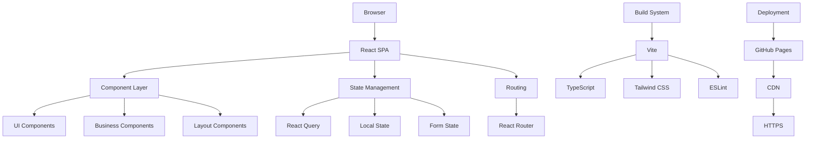
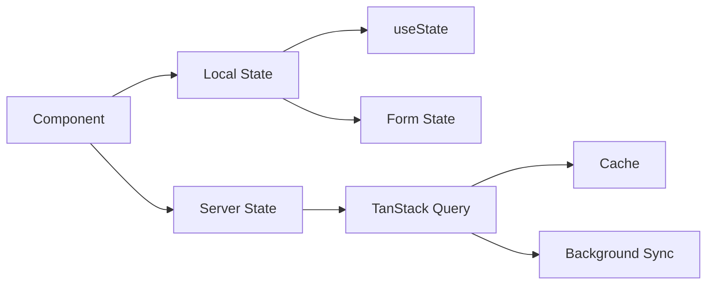

# System Architecture Overview

## Table of Contents
- [High-Level Architecture](#high-level-architecture)
- [Frontend Architecture](#frontend-architecture)
- [Component Hierarchy](#component-hierarchy)
- [State Management](#state-management)
- [Data Flow](#data-flow)
- [Build & Deployment](#build--deployment)
- [Performance Considerations](#performance-considerations)
- [Security Architecture](#security-architecture)

## High-Level Architecture

Tiation Wellness Hub is built as a modern single-page application (SPA) using React 18.3.1 with TypeScript. The architecture follows a component-based approach with clear separation of concerns.



## Frontend Architecture

### Technology Stack
- **Framework**: React 18.3.1 with TypeScript 5.5.3
- **Build Tool**: Vite 5.4.1
- **Styling**: Tailwind CSS 3.4.11
- **UI Components**: shadcn/ui
- **State Management**: TanStack Query 5.56.2
- **Routing**: React Router 6.26.2
- **Form Handling**: React Hook Form 7.53.0
- **Validation**: Zod 3.23.8

### Project Structure
```
src/
├── components/          # Reusable UI components
│   ├── ui/             # shadcn/ui components
│   ├── layout/         # Layout components
│   └── wellness/       # Domain-specific components
├── pages/              # Route components
├── hooks/              # Custom React hooks
├── lib/                # Utility functions
├── types/              # TypeScript type definitions
└── styles/             # Global styles
```

## Component Hierarchy

### Layout Components
- **Header**: Navigation and branding
- **Footer**: Links and contact information
- **Layout**: Main page wrapper

### Page Components
- **Index**: Main landing page
- **NotFound**: 404 error page

### Feature Components
- **HeroSection**: Landing page hero
- **AboutSection**: Company information
- **ServicesSection**: Service offerings
- **WellnessSection**: Wellness programs
- **ContactSection**: Contact information

### UI Components
- **Button**: Reusable button component
- **Card**: Content card container
- **Dialog**: Modal dialogs
- **Form**: Form components
- **Navigation**: Navigation elements

## State Management

### Local State
- Component-level state using `useState`
- Form state with React Hook Form
- UI state (modals, menus, etc.)

### Server State
- API data caching with TanStack Query
- Background refetching
- Optimistic updates

### State Flow


## Data Flow

### Component Communication
1. **Props**: Parent to child communication
2. **Callbacks**: Child to parent communication
3. **Context**: Cross-component state sharing
4. **Custom Hooks**: Reusable stateful logic

### Event Handling
- User interactions trigger state updates
- Form submissions with validation
- Navigation events with React Router
- Smooth scrolling for section navigation

## Build & Deployment

### Development Build
```bash
npm run dev
```
- Hot module replacement
- Source maps for debugging
- Fast refresh for React components

### Production Build
```bash
npm run build
```
- Code splitting and tree shaking
- Asset optimization
- Bundle analysis
- TypeScript compilation

### Deployment Pipeline
1. **CI/CD**: GitHub Actions
2. **Testing**: Automated test runs
3. **Linting**: Code quality checks
4. **Build**: Production build generation
5. **Deploy**: GitHub Pages deployment
6. **Monitoring**: Lighthouse CI performance checks

## Performance Considerations

### Bundle Optimization
- **Code Splitting**: Route-based lazy loading
- **Tree Shaking**: Dead code elimination
- **Minification**: JavaScript and CSS compression
- **Caching**: Long-term asset caching

### Runtime Performance
- **Virtual DOM**: Efficient rendering
- **Memoization**: React.memo and useMemo
- **Lazy Loading**: On-demand component loading
- **Image Optimization**: Responsive images

### Core Web Vitals
- **FCP**: First Contentful Paint < 1.5s
- **LCP**: Largest Contentful Paint < 2.5s
- **CLS**: Cumulative Layout Shift < 0.1
- **FID**: First Input Delay < 100ms

## Security Architecture

### Client-Side Security
- **XSS Prevention**: React's built-in protection
- **Input Validation**: Zod schema validation
- **HTTPS**: Encrypted communication
- **CSP**: Content Security Policy headers

### Data Protection
- **No Sensitive Data**: Client-side storage avoided
- **GDPR Compliance**: Privacy-first approach
- **Secure Headers**: Security-focused HTTP headers

### Build Security
- **Dependency Scanning**: Automated vulnerability checks
- **Code Analysis**: Static security analysis
- **Secrets Management**: No hardcoded secrets

## Scalability Considerations

### Horizontal Scaling
- **CDN**: Global content distribution
- **Caching**: Multi-level caching strategy
- **Load Balancing**: Geographic distribution

### Vertical Scaling
- **Code Splitting**: Reduced initial bundle size
- **Lazy Loading**: On-demand resource loading
- **Service Workers**: Background processing

### Future Architecture
- **Micro-frontends**: Modular architecture
- **API Gateway**: Centralized API management
- **Event-Driven**: Decoupled communication
- **Progressive Enhancement**: Graceful degradation

## Development Guidelines

### Code Quality
- **TypeScript**: Strict type checking
- **ESLint**: Code linting rules
- **Prettier**: Code formatting
- **Husky**: Git hooks for quality gates

### Testing Strategy
- **Unit Tests**: Component and utility testing
- **Integration Tests**: Feature testing
- **E2E Tests**: User workflow testing
- **Performance Tests**: Core Web Vitals monitoring

### Documentation
- **Code Comments**: JSDoc for complex functions
- **README**: Comprehensive project documentation
- **Architecture Docs**: System design documentation
- **API Docs**: Interface documentation

## Monitoring & Analytics

### Performance Monitoring
- **Lighthouse CI**: Automated performance testing
- **Core Web Vitals**: Real user monitoring
- **Bundle Analysis**: Size and optimization tracking

### Error Tracking
- **Error Boundaries**: React error handling
- **Console Monitoring**: Development error tracking
- **User Feedback**: Error reporting mechanisms

### Analytics Integration
- **Google Analytics**: User behavior tracking
- **Performance Metrics**: Core Web Vitals
- **Conversion Tracking**: Goal completion monitoring

---

This architecture provides a solid foundation for a scalable, maintainable, and performant wellness platform while maintaining enterprise-grade standards and security practices.
